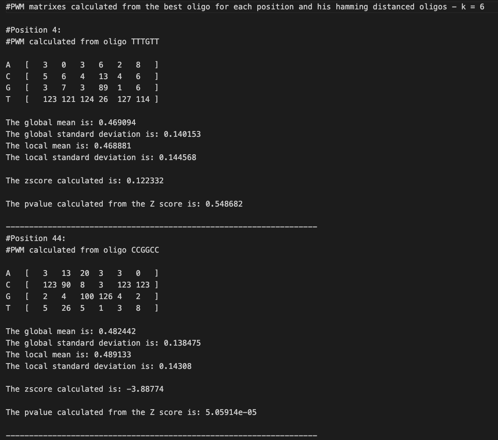
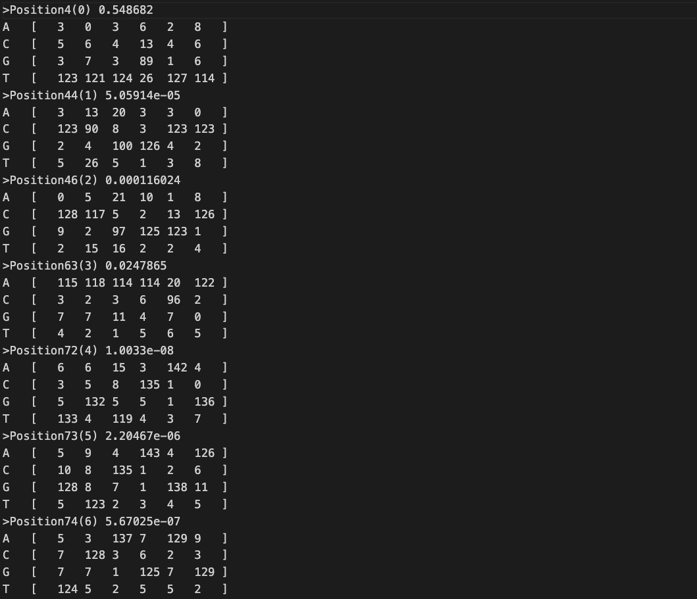
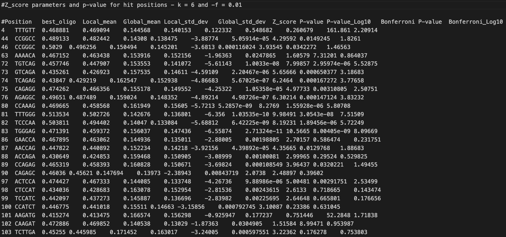

# **MOCOLOCO**: tool instruction and report <br>
## A tool to analyze a TF chip-seq data and to find nearby TFBS to discover or validate co-activity between different TFs in transcription activation process
<br>  

## **MOCOLOCO INPUT/OUTPUT**
<br>

### The program has **supports multiple inputs**.
<ul><br>
1. BED, TwoBit and Jaspar files in input.<br>
<ul><li> A BED file format is a text file used to store genomic regions as coordinates (and eventually also associated annotations).
<li> A TwoBit is a binary file format used for storing big biological data (Genomes,chromosomes, etc..). It is useful because of his reading speed, which is an order of magnitude faster than a FASTA file format.
<li> A JASPAR matrix is a file format coming from JASPAR database, in which TF binding profiles are stored as position frequency matrices (PWMs).
<br><br></ul>
2. Multifasta file in input.
<ul><li> A Multifasta file format contains multiple FASTA sequences, which must be of the same length.
</ul><br>  

### To **compile** the program the command needed in both cases is:

      g++ -o test -Wall Mocoloco.cpp -lgsl (-lgslcblas command is need to be added in certain systems) -O3
<br>  

### The tool can be **executed** in different ways:
<br><ul>
1.**BED,TwoBit,Jaspar input**:
       
       ./test -b <file.bed>  -p <number>(optional) -t <file.2bit> -j <file.JASPAR> -k <number, number, ...>(optional) -d <number, number, ...>(optional) -o p(optional) -e <number>(optional) -f <number, number, ...>(optional) -s(optional) -u(optional) -l(optional) -z <number>(optional) -r <number>(optional)`
       
2.**Multifasta input**:
       
       ./test -m <file_multifasta.fa>  -p <number>(optional) -k <number, number, ...>(optional) -d <number, number, ...>(optional) -o p(optional) -e <number>(optional) -f <number, number, ...>(optional) -s(optional) -l(optional) -z <number>(optional) -r <number>(optional)
</ul><br>  

|Option |Parameter  |Description                                        |
|:-----:|:---------:|:-------------------------------------------------:|
| -b    | --bed     |Input bed file                                     |
| -m    | --mf      |Input multifasta file                                                      |
| -t    | --twobit  |It is used with bed file to know from which genome extract the sequences   |
| -j    | --jaspar  |Specify the jaspar file used as primary motif (used only if bed file as input file)        |
| -k    | --kmer    |Length of k-mers in the analysis (DEFAULT: 6,8,10)                         |
| -d    | --distance|It refers to the Hamming distance for the creation of oligos cluster (DEFAULT: 1,2,3)   |
| -p    | --param   |It is the half-length of the sequences (DEFAULT: 150)                      |
| -s    | --ss      |To run the anlysis as single strand (DEFAULT: double strand)               |
| -o    | --ordering|It defines if the best oligos are ordered by pvalue (```-o p```) or by occurrences (DEFAULT)|
| -f    | --freq    |Set the frequency treshold to calculate the Zscore                         |
| -e    | --exp_max |Refine the PWM matrices using the expectation maximization algorithm       |
| -l    | --tomtom  |Set the output format suitable for Tomtom from MEME                        |
| -u    | --unidirection|It orders the sequences in the same direction                          |
| -r    | --secondary|Set how secondary matrices I need in the analysis                         |
| -z    | --z_pval_threshold|Set the Zscore p-value threshold for eventually secondary matrices |
| -a    | --cleaning|Disable the cleaning of sequences with low primary motif scores (DEFAULT: ON)|

## **MOCOLOCO WORKFLOW**
<br>
Firstly all libraries, global variables, classes and function declarations, which are written in MocoLoco.h file, are included.
Then the <i><u>command_line_parser</i></u> function handles the input parameter assigning them to the rignt variables. This function is also able to control the validity and the existance of parameters and it is trained to report errors in case of incorrect arguments.<br>
Once global variables are assigned correctly, the tool is ready to process the informations.<br>
After the parser function there is a check to analyze the input and choose the right workflow between the two different execution of the program.<br>
<br>

### **BED/TWOBIT/JASPAR Pathway**:

If MocoLoco recognizes a bed/twobit/jaspar input, it immediately creates a <i><u>JasparClass</i></u> J from the Jaspar file and then a <i><u>MatrixClass</i></u> mat, when the matrix is calculated the program analyse all the sequences and retrieve the scores of the Jaspar matrix on the sequences, this allow the tool to find the position in the sequence where there is the primary motif.
Then the sequences are recentered with the primary motif in the middle and the fasta file for further analysis is created.
<br>
### **MULTIFASTA Pathway**:
If MocoLoco recognizes a Multifasta input it starts directly from the creation of maps by MapClass.
<br>
Now the two pathways converges into one and the next step is the creation of <i><u>PValueClass</i></u> P where each oligo of length k is associated with its Pvalue, then the oligos for each position are sorted (by occurrences or by pvalue) and thanks to the <i><u>HammingClass</i></u> H there is the creation of clusters of oligos at Hamming distance with respect of the seed oligo of the cluster (that is the best oligo for each position).
Last, once the PWMs are calculated there is <i><u>z_test_class</i></u> Z where each PWM is shifted on the sequences and with the scores calculated the tool is able to measure the Z-Pvalue that allow the user to know if at this position the PWM is conserved or not.
<br><br>
### **BED CLASS** <br>
For each genomic coordinate in the bed file or sequence in the multifasta file an object of <i><u>bed class</i></u> is created.<br> 
The constructor needs 3 parameters (**BED_FILE** = the input BED file, **MFASTA_FILE** = the input multifasta file **tb** = Twobit file).<br>
Once the constructor is called and the parameters are passed, subsequently the data are managed through one bed class function:


1. <i><u>ReadBed</u></i>:<br>
This function recognize if the input file is BED or fasta:
* if the input is BED format the coordinates from the file are saved and with the function <i>twobit_sequence</i> the sequences can be stored.
* if the input is a multifasta file the function sets the coordinates equal to zero and it reads the sequences from the input file.
In both cases the informations are saved into a vector of structures. <br><br>

### **JASPAR CLASS** <br>

The constructor needs one parameter (**JASPAR_FILE** = the input Jaspar file) and it is composed of one function, <i><u>ReadJaspar</u></i>, it **takes the Jaspar file inserted in input and extracts the numeric values**, saving them in a double type vector of vectors.<br>
There is another function <i><u>ReturnJaspar</u></i> that allow us to use the private element of JasparClass even if we are outside the class.

### **MATRIX CLASS** <br>

The constructor take as argument the Jaspar matrix created before and inside there are three functions:<br>
<ul>

1. <i><u>MatrixNormalization</i></u>:<br>
Here the **matrix values are normalized** for two times (the function is called two times). They are normalized **by column**, thus a vector of column sums is firstly calculated thanks to the function <i><u>ColSum</i></u>. Each value of the matrix is normalized by dividing it by the sum of its column. Then **a pseudocount (0,01) is added** to avoid to have some 0 into the matrix.<br>
The **second normalization is done** without the psudocout.
Also this time the <i><u>ColSum</i></u> function is used to recalculate the column sums.

2. <i><u>MatrixLog</i></u>: <br>
After the two normalization another filtering is required. With this function the tool takes matrix values and **substitutes them with their natural logarithms**.<br>

3. <i><u>InversemLogMatrix</i></u>:<br>
A simple function called reverse matrix is used to reverse the matrix values. The elements of the matrix are rotated along two axis. For example the first value (0,0) becomes the last (n,n) and viceversa. The aim of that is to create a jaspar matrix which is able to analyze the reverse strand in double strand workflow.<br>
</ul>
Also in MatrixClass we have some functions to retrieve the matrixes outside the class, these functions are <i><u>ReturnMatrix</i></u> and <i><u>ReturnInverseMatrix</i></u>.<br><br>

### **SCORE CLASS** <br>

This is the only class that has two constructors, **the goal of this class is to scroll the matrix along each sequence and define a score for each oligo**.  The scores will be saved in a **score vector** and each sequence will have its own score vector.<br>
The first construct is called when the tool needs to find the best position for the matrix of the primary motif (the input Jaspar matrix) for each sequence, there are three main functions:
<ul>

1. <i><u>FindMinMax</i></u>:<br>
This function calculates the maximum and the minimum possible score that an oligo can have and it saves them into two double variables.

2. <i><u>Shifting</i></u>:<br>
This is the hub function of the class. It allows to **shift the sequence on the matrix** and, for each oligo, to **calculate the score following matrix values** storing the scores in a vector for each sequence. <br> 
For each score calculated by this function the tool applies a normalization:
$$ ScoreNormalized =  1 + \frac{score - MaxPossibleScore}{MaxPossibleScore - MinPossibleScore} $$

3. <i><u>BestScore</i></u>:<br>
**Here, the best match for each sequence between oligo and jaspar matrix is found**.<br> If the best oligo is only one then, once identified, its **position** is extracted, returned by the function and finally **saved into mCentralPosition variable**.<br>
On the other hand, if the best score is found in more than one oligo, the function ensures that the position returned is the one closest to the centre.<br>
After this the coordinate for the center of the sequence is calculated with this equation (where StartCoordGEP is the starting coordinate of the sequence and CenteredStart is the coordinate where the Jaspar matrix is found in the sequence):
$$ CenteredStart = StartCoordGEP + mCentralPosition $$ 
</ul>

Now with the coordinates for the sequences where there is the primary motif the tool with <i><u>Centering</i></u> function changes all the coordinates using the half_length parameter inserted by the user. <br>

If the analysis run in double strand and the option -u is present there is another function called <i><u>ReCentering</u></i> that switch the sequences where the primary motif is found in the reverse strand, this function also takes into account of the shifting of one base if the matrix is even.<br><br>

The second construct is called when the tool needs to find the scores of PWMs for each column in the sequences (this will be clear after the explaination of other classes), the functions are just two because the constructor returns the scores vector of PWM in the sequences:

<ul>

1. <i><u>FindMinMax</i></u>:<br>
This function calculates the maximum and the minimum possible score that an oligo can have and it saves them into two double variables.

2. <i><u>Shifting</i></u>:<br>
This is the hub function of the class. It allows to **shift the sequence on the matrix** and, for each oligo, to **calculate the score following matrix values** storing the scores in a vector for each sequence. <br> 
For each score calculated by this function the tool applies a normalization:
$$ ScoreNormalized =  1 + \frac{score - MaxPossibleScore}{MaxPossibleScore - MinPossibleScore} $$
</ul><br><br>

### **MAP CLASS** <br>

This is a very important class because in this class all the occurrences of each oligo are calculated.<br>
The construct has two main functions:
<ul>

1. <i><u>MainMapVector</i></u>:<br>
Where **all the maps are created**, this function creates Horizontal (with the occurrences of oligos in all the input file) and Vertical (with the occurrences of oligos for each column/position in the sequence) maps.<br>
This function recalls two functions:
<ul>

1. <i><u>CountOccurrencesHor</i></u>:<br>
Here, **the tool counts all the occurrences in the input file for each oligo** and store this information using HorizontalClass (see later).

2. <i><u>CountOccurrencesVer</i></u>:<br>
Here, **the tool counts the occurrences for each column for each oligo** and store this information using VerticalClass (see later).
</ul>

2. <i><u>VerticalMapVector</i></u>:<br>
With this function is created a Vertical Map with just the oligos actually present in the column (the Vertical Map obtained before with MainMapVector gives zero if an oligo is not present in the column). 
</ul>
<br><br>
Once the tool knows the occurrences of all the oligos it can start with the analysis, the first thing is to make a PValueClass for each oligo present in the column.<br><br>

### **HORIZONTAL CLASS** <br>

There is no constructor but each element of this class contains:

* the oligo (e.g. ACCTGC) and its reverse (e.g. GCAGGT).
* the horizontal occurrences of the oligo and its reverse.
* a boolean variable which tells if the oligo is palindrome or not.<br><br>
### **VERTICAL CLASS** <br>
Also for this class there is no constructor but each element of this class contains:

* the oligo (e.g. ACCTGC) and its reverse (e.g. GCAGGT).
* the vertical occurrences of the oligo and its reverse.
* a boolean variable which tells if the oligo is palindrome or not.<br><br>
### **PVALUE CLASS** <br>

This class has only one function in the constructor but it is quite tricky, before talking about the function it is important to keep in mind that:

* <i>T</i> is the **number of sequences**.
* <i>K</i> is the **number of vertical occurences**.
* <i>N1</i> is the **number of horizontal occurrences**.
* <i>N2</i> is the **total number of oligos in the input file minus N1**. <br><br>

The function of this constructor is called <i><u>TKN1Calc</i></u>, it calculates K, N1, N2 and T in order to obtain the hypergeometric p-value.<br><br>

After this the tool rank the oligos based on the vertical occurrences or the hyergeometric p-value (the user can determine this with -o option), and for the first oligo of each column the HammingClass is performed.

### **HAMMING CLASS** <br>

This class has many functions inside the constructor:
<ul>

1. <i><u>CheckSeed</i></u>:<br>
Where **the cluster of oligos in the column is formed**, the cluster contains oligos at a certain Hamming distance from the seed oligo (the first oligo in the rank for each column).
First of all every oligos present in the column are checked if at Hamming distance from the seed oligo, if this is true they are stored in a vector (if the analysis is in double strand also the reverse oligo is stored in another vector) and the vertical occurrences are summed up

2. <i><u>Freq1Calc</i></u>:<br>
The parameter for <i>-f</i> option is calculated, this frequency is the ratio between the number of oligos in the cluster and the number of all the sequences.

3. <i><u>HoccCalc</i></u>:<br>
This function sum up all the horizontal occurrences of oligos present in the cluster.
4. <i><u>Freq2Calc</i></u>:<br>
Another frequency from the ratio between the number of oligos in the cluster and the sum of the horizontal occurrences of oligos in the cluster.
5. <i><u>PWMHammingCalc</i></u>:<br>
This function **builds the PWM matrix with cluster oligos occurrences**.
This is an example of PWM for CGAATT oligo:

$$\begin{bmatrix}A & 0 & 2 & 10 & 10 & 2 & 2 \\
C & 10 & 1 & 0 & 0 & 0 & 1\\
G & 0 & 7 & 0 & 0 & 0 & 2\\
T & 0 & 0 & 0 & 0 & 8 & 5
\end{bmatrix}$$

6. <i><u>ClearVertical</i></u>:<br>
At the end of each PWM the oligos used in that column for the creation of the PWM are removed, this is useful when the tool perform more than one analysis per column.
</ul><br><br>

### **EM CLASS** <br>

This class is where the Expectation Maximization algorithm is performed, this algorithm is based on two steps:

* The Expectation step, represented by the function <i><u>EM_Epart</i></u>, where we obtain the likelihood ratio for each oligo in the vertical map (we give to each oligo a sort of weigth based on the probability that find this oligo in that column is random or not).

* The Maximization step is represented by the <i><u>EM_Mpart</i></u> where the PWM is reconstructed taking into account the likelihood ratios.

These two steps are inside the <i><u>EM_cycle</i></u> function because more cycles of this algorithm can be performed in order to refine the PWM.<br><br>

### **Z TEST CLASS** <br>

This class receive the PWM from the HamimngClass and through <i><u>oligos_vector_creation_PWM</i></u> the PWM is shifted on the sequences measuring the local and global scores of the PWM, the local scores are the score of this PWM in the column while the global scores are the scores of the PWM in all the input file.
<br>After this, the <i><u>z_score_parameters_calculation</i></u> function measures all the parameters for the z_score calculation (these parameters are global mean, local mean, global standard deviation and local standard deviation).
<br>In the end the z_score is calculated with this equation:
$$ ZScore = \frac{GlobalMean - LocalMean}{\frac{GlobalDevStandard}{\sqrt{AllLocalScoresSize}}} $$
<br><br>

### **THE OUTPUT** <br>

At the end of all the analysis MocoLoco creates two output files:

1. The file with **PWMs from clusters above the threshold**.<br>
This type of output can be present in two different formats, one more extensive and the other adapted for the use in [Tomtom](https://meme-suite.org/meme/doc/tomtom.html?man_type=web).<br>
The extended format contains information like the position, the seed oligo from which the cluster is formed, the PWM and the parameter for the calculation of Z score.<br><br>
<br><br>
While the format adapted for Tomtom lack of informations and basically it contains only the PWM and Z-score pvalue<br><br>
<br><br>

2. The file with **p-value from Z_score for each cluster above the threshold** where many informations are contained like the position, the best oligo, local and global mean and standard deviation, Z_score, pvalue, Log10pvalue, pvalue corrected with Bonferroni and the Log10pvalue corrected with Bonferroni.<br><br>
<br><br>